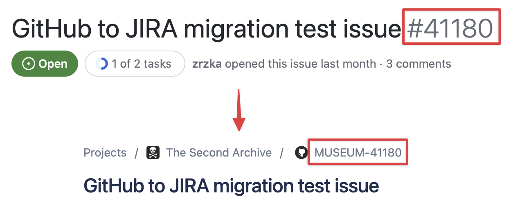
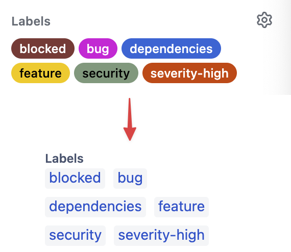
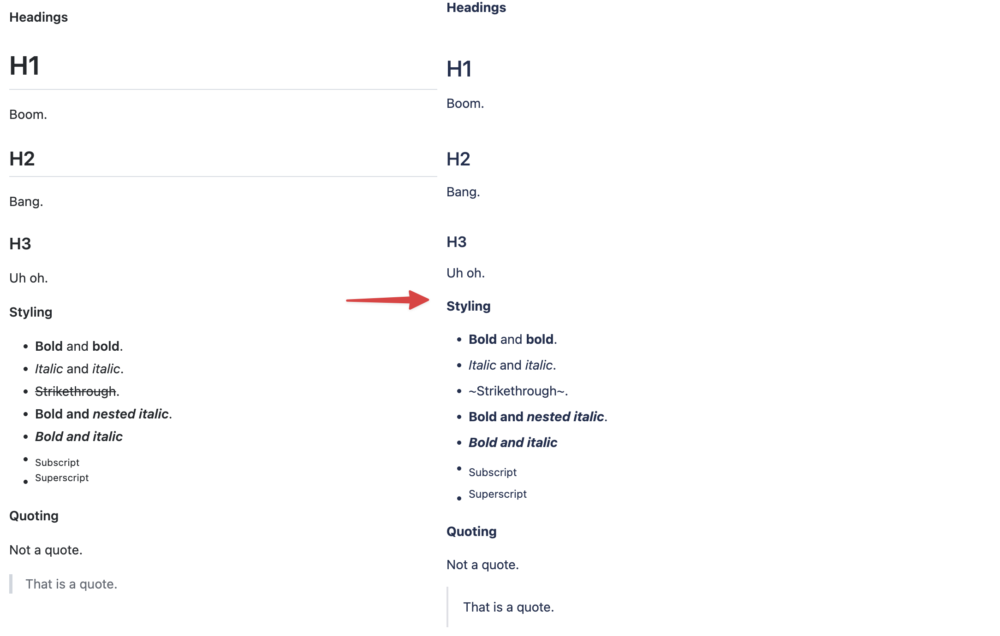
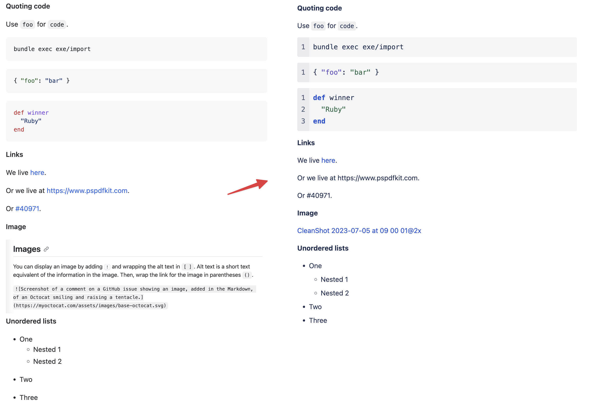
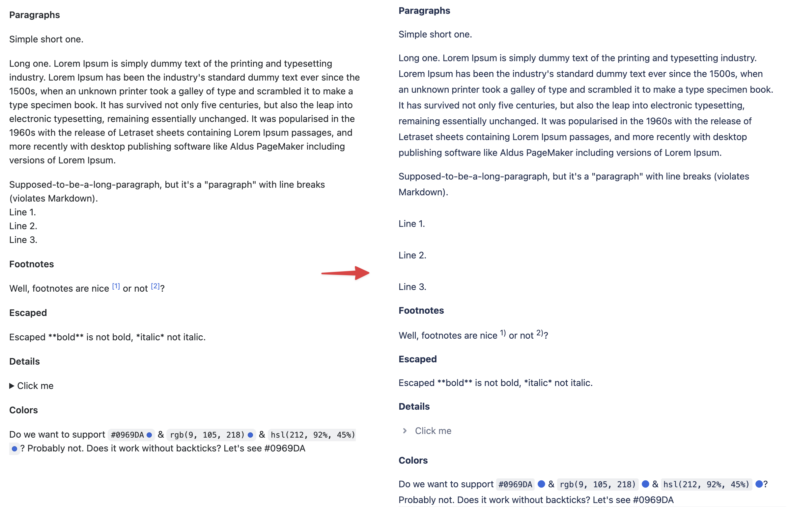
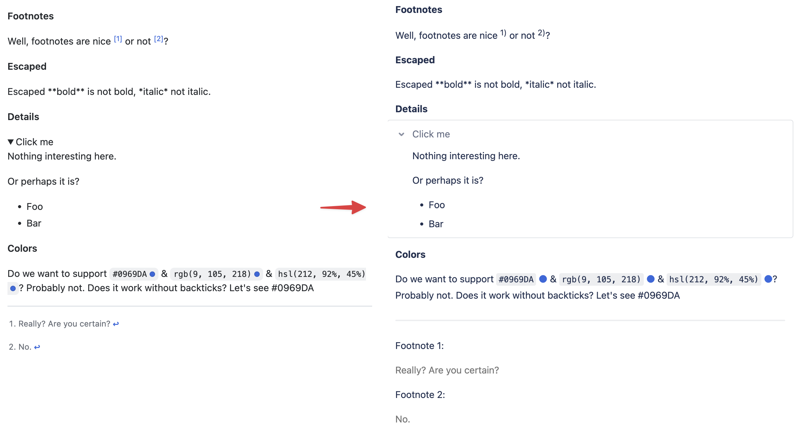

# GitHub to Jira Migration

A couple of scripts (better, hacks, do not judge) to migrate GitHub
issues to Jira issues.

> We have decided to share what we did, how we migrated it, but we do
> NOT provide any support for these scripts. **USE AT YOUR OWN RISK!**

Do not create pull requests, they won't be accepted. It is a project
we do not aim to develop. It served us well. Fork it, tweak, so it
fulfills your needs, migrate, and be happy too!

## Overview

It is a multistep process:

- `exe/1-dump-github` - dump GitHub issues to `data/` folder
- `exe/2-json-for-import` - generate JSON file for Jira import
- `exe/3-update-bodies` - iterate over all issues and update bodies

Why? We wanted to preserve the `created_at` date & the GitHub issue
number (e.g. GitHub #123 -> Jira ARCHIVE-123). This can be achieved
via the JSON import only. We also wanted to make the bodies nice (as
close to GitHub as possible), and this is possible via the
[Atlassian Document Format](https://developer.atlassian.com/cloud/jira/platform/apis/document/structure/)
only (unless you'd like to figure out how to transform GitHub Markdown
to Jira one). The JSON import way does not support ADF, only REST API
v3 does.

Why do we operate on a local GitHub dump? We have plenty of issues
(tens of thousands) and there's GitHub rate limiting in place. Not
just for your token, but also organization wide. Because the
`exe/3-update-bodies` script is executed many times (e.g. update,
check, tweak, repeat until you're happy), we have experienced
throttling. We have also experienced organization wide throttling,
which caused disruptions to other services like CI.

## Examples

<details>
<summary>
It is far from perfect, but good enough. Check it to see what's
supported.
</summary>









</details>

## Setup

All this is up-to-you, but you should get the requirements.

### Tools

- [Install asdf](https://asdf-vm.com/)
- [Install asdf-ruby](https://github.com/asdf-vm/asdf-ruby)
- Install required Ruby version (`asdf install`)
- Install `direnv` (`brew install direnv`)

### Credentials

Add the following to the `.envrc` file:

```sh
export GITHUB_TOKEN="abc"
export GITHUB_REPO="your-org/repo"
export JIRA_USERNAME="your@email.com"
export JIRA_TOKEN="your-token"
export JIRA_PROJECT_KEY="MUSEUM"
export JIRA_HOST="company.atlassian.net"
export AUTOMATION_FOR_JIRA_USER_ID="123242:asas..."
```

You can create an API token
[here](https://id.atlassian.com/manage-profile/security/api-tokens).

`AUTOMATION_FOR_JIRA_USER_ID` is an Atlassian user identifier being
used in case the script can't find the GitHub to Atlassian mapping,
and Jira requires a user.

Once set, execute `direnv allow`.

If you're using Proxyman, and you'd like to see what's going on, then
add the following to `.envrc` too:

```
export PROXY_HOST="localhost"
export PROXY_PORT=9090
```

### Data

You MUST provide GitHub user to Atlassian user identifier mappings in
the `data/github-to-atlassian.csv` file. An example:

``` csv
github_login,atlassian_id
zrzka,34534532342341
foo,2342342:9bde4ffb-7d3b-4904-a2cf-827f56b34ae2
```

## Run

1. Dump GitHub issues & comments (`bundle exec exe/1-dump-github`)
2. Generate JSON for import (`bundle exec exe/2-json-for-import`)
3. Update bodies (`bundle exec exe/3-update-bodies`)
4. Fix `Sin::Body#ast_to_adf` (add your own hacks, ...), update
   bodies, repeat until you're happy

You can import the JSON file generated in step 2
[here](https://pspdfkit.atlassian.net/secure/admin/ExternalImport1.jspa).
